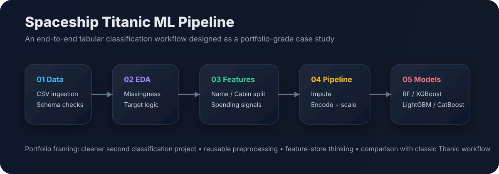
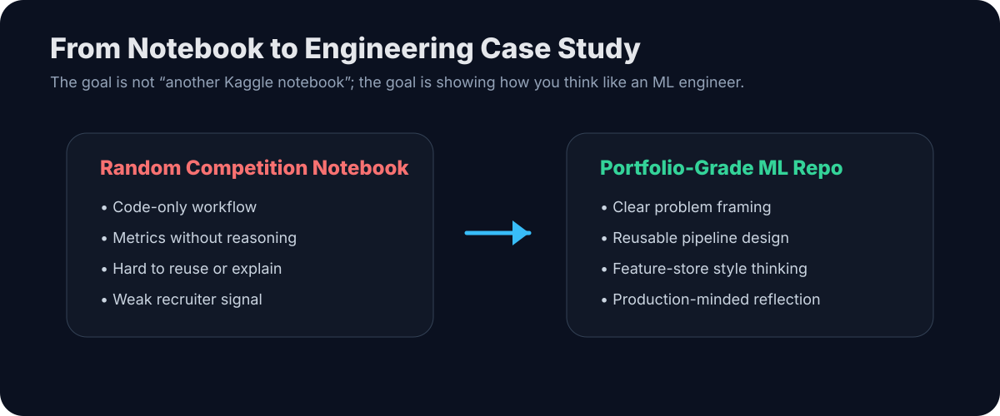
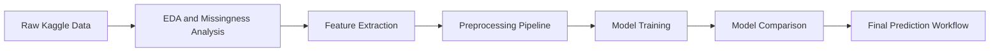

# 🚀 End-to-End Tabular Classification Pipeline Design

<p align="center">
  
</p>

<p align="center">
  
  
  
  
</p>

## 1. Project Summary

**Spaceship Titanic** is a Kaggle tabular classification challenge where the goal is to predict whether a passenger was **transported to an alternate dimension**.

I did not build this as “just another Kaggle notebook.”

I used it as a portfolio case study for:

- cleaner preprocessing design
- feature engineering from semi-structured columns
- reusable scikit-learn pipeline construction
- model comparison across tree-based classifiers
- feature-store style thinking for tabular ML
- a better second classification project after the classic Titanic workflow

The main portfolio angle is:

> **How to design an end-to-end tabular classification pipeline, not just chase leaderboard score.**

---

## 2. Why This Project Matters

The classic Titanic project is useful for learning the basics, but it is often too simple to show engineering maturity.

Spaceship Titanic is a stronger second classification project because it includes:

| Area | Why It Is Useful |
|---|---|
| Missing values | Requires a consistent imputation strategy |
| Mixed data types | Numerical, categorical, boolean, and semi-structured text |
| Feature extraction | `Cabin`, `PassengerId`, and `Name` can be decomposed into useful signals |
| Pipeline design | Preprocessing and modeling should be connected cleanly |
| Model comparison | Multiple models can be compared without rewriting the full workflow |

<p align="center">
  
</p>

---

## 3. Business-Style Problem Framing

Imagine a future interstellar travel company wants to identify passengers at higher risk of being transported during a space-time anomaly.

A machine learning system could support:

- anomaly-risk monitoring
- passenger-level risk prediction
- investigation of patterns across cabin groups, home planets, destinations, and spending behavior
- rapid experimentation with different modeling strategies

This case study treats the Kaggle task as a small but realistic tabular ML system.

---

## 4. Repository Structure

```text
spaceship-titanic-end-to-end-tabular-classification/
│
├── notebooks/
│   ├── 01_spaceship_titanic_final_model.ipynb
│   └── 02_spaceship_titanic_portfolio_case_study.ipynb
│
├── docs/
│   ├── case_study.md
│   ├── data_contract.md
│   ├── feature_engineering.md
│   ├── model_card.md
│   └── production_notes.md
│
├── assets/
│   ├── pipeline_overview.svg
│   └── repo_positioning.svg
│
├── data/
│   ├── raw/
│   └── processed/
│
├── models/
├── reports/
│   └── figures/
│
├── requirements.txt
├── .gitignore
└── README.md
```

### Important Note

The notebook code is preserved.  
This repository focuses on **architecture, documentation, storytelling, and presentation** around the existing work.

---

## 5. ML Workflow



The workflow follows a practical ML pattern:

1. Understand the data contract.
2. Inspect missing values and target balance.
3. Extract meaningful features from existing columns.
4. Build reusable preprocessing pipelines.
5. Train multiple models.
6. Compare validation behavior.
7. Prepare the project for portfolio presentation.

---

## 6. Feature Engineering Strategy

This project demonstrates how raw tabular columns can be converted into cleaner modeling signals.

Examples:

| Raw Column | Engineering Idea |
|---|---|
| `PassengerId` | Extract passenger group information |
| `Cabin` | Split into deck, cabin number, and side |
| `Name` | Extract family/group-level signals |
| Spending columns | Combine or analyze luxury spending behavior |
| `CryoSleep` | Use relationship with spending behavior |
| Categorical columns | Encode consistently through pipeline |

The goal is not just to create features randomly.

The goal is to create features that represent passenger behavior, travel grouping, and cabin structure.

---

## 7. Modeling Approach

The notebook explores a practical model progression:

| Model Family | Purpose |
|---|---|
| Random Forest | Strong baseline for tabular data |
| XGBoost | Gradient boosting benchmark |
| LightGBM + Optuna | Tuned boosting experiment |
| CatBoost | Strong categorical/tabular model comparison |

This structure is useful for a portfolio because it shows that the project is not tied to one algorithm.

The pipeline is designed so new models can be tested without rewriting preprocessing from scratch.

---

## 8. Validation Snapshot

From the notebook outputs:

| Experiment | Validation Result |
|---|---:|
| Random Forest pipeline | ~0.794 validation accuracy |
| XGBoost experiment | ~0.918 accuracy on the transformed split used in the notebook |
| CatBoost experiment | ~0.872 accuracy |

These numbers should be interpreted carefully because different experiment cells use slightly different training/evaluation patterns.

The more important engineering lesson is:

> A good ML repo should explain **how the validation was created**, not just report the biggest number.

---

## 9. What Makes This Portfolio-Ready

This repo is designed to show more than “I trained a model.”

It shows:

- problem framing
- clean project organization
- preprocessing decisions
- model comparison
- feature-engineering reasoning
- limitations and future improvements
- production-readiness thinking

That is what recruiters, clients, and senior engineers look for.

---

## 10. How to Run

### Step 1 — Clone the repo

```bash
git clone https://github.com/<your-username>/spaceship-titanic-end-to-end-tabular-classification.git
cd spaceship-titanic-end-to-end-tabular-classification
```

### Step 2 — Create a virtual environment

```bash
python -m venv .venv
```

Activate it:

```bash
# Windows PowerShell
.venv\Scripts\Activate.ps1

# macOS/Linux
source .venv/bin/activate
```

### Step 3 — Install dependencies

```bash
pip install -r requirements.txt
```

### Step 4 — Add Kaggle data

Download the competition data from Kaggle and place the files here:

```text
data/raw/train.csv
data/raw/test.csv
```

### Step 5 — Open the notebook

```bash
jupyter notebook notebooks/01_spaceship_titanic_final_model.ipynb
```

---

## 11. Main Lessons Learned

### 1. Pipeline design matters more than isolated model training

A notebook can get a score.  
A pipeline can be reused, debugged, explained, and improved.

### 2. Feature engineering should follow domain logic

Columns like `Cabin`, `PassengerId`, and spending behavior contain structure.  
A good tabular workflow should extract that structure carefully.

### 3. Validation needs discipline

The highest metric is not always the most trustworthy metric.  
A production-minded ML project explains the validation setup clearly.

### 4. A portfolio project needs a story

This repo is positioned as:

> A second classification project that improves upon the classic Titanic workflow by focusing on cleaner engineering design.

---

## 12. Future Improvements

If this were moved closer to production, I would add:

- stricter train/validation separation
- a single experiment tracking table
- saved preprocessing/model artifacts
- a modular `src/` training pipeline
- feature importance and SHAP explanations
- model calibration
- automated data validation
- CI checks for notebook execution
- Kaggle submission script

---

## 13. Portfolio Positioning

Use this project in your portfolio as:

> **Spaceship Titanic — End-to-End Tabular Classification Pipeline Design**

Not as:

> “I solved another Kaggle competition.”

The difference is important.

This project shows how a beginner Kaggle workflow can be transformed into a serious ML engineering case study.

---

## 14. Suggested GitHub Description

```text
A portfolio-grade Spaceship Titanic ML case study focused on end-to-end tabular classification pipeline design, feature engineering, preprocessing, and model comparison.
```

---

## 15. Suggested Topics

```text
machine-learning
tabular-data
classification
kaggle
scikit-learn
xgboost
lightgbm
catboost
feature-engineering
ml-pipeline
portfolio-project
```
